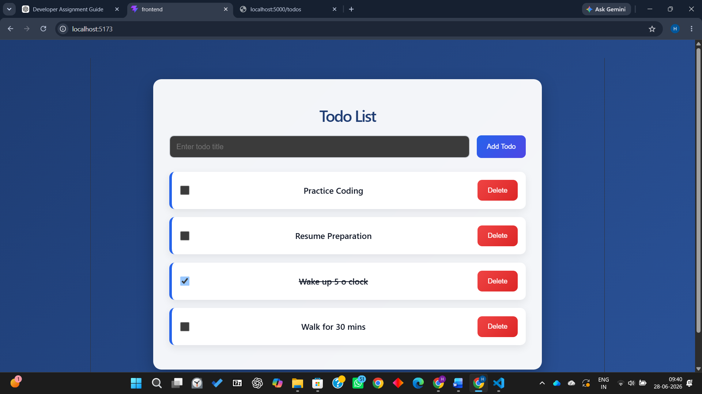
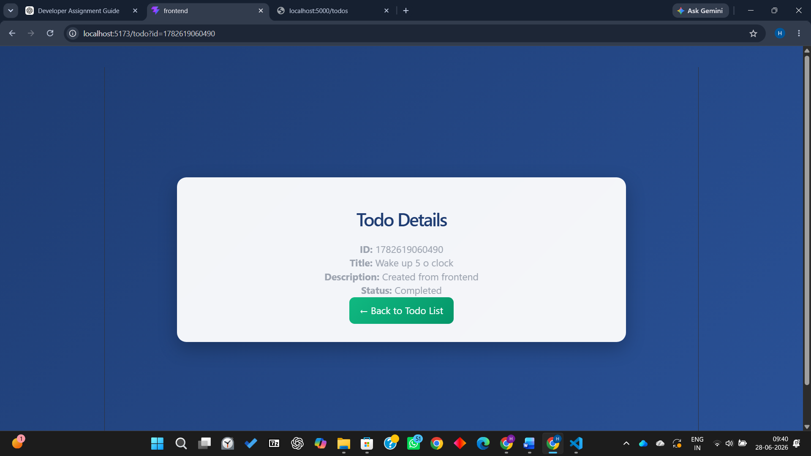

# Ziptrrip Todo Application

A full-stack **Todo Application** developed as part of the Ziptrrip Developer Assignment. The application is built using **React** for the frontend and **Node.js with Express.js** for the backend. It supports complete CRUD (Create, Read, Update, Delete) operations and stores data in a local JSON file.

---

# Features

## Frontend

* Multi-page React application
* Todo List page
* Todo Details page
* Add new todos
* Mark todos as Completed/Pending
* Delete todos
* Navigate to Todo Details using Query Parameters
* Modern and responsive user interface

## Backend

* Built using Node.js and Express.js
* RESTful CRUD APIs
* JSON file storage (`todos.json`)
* CORS enabled for frontend-backend communication

---

# Technologies Used

### Frontend

* React
* Vite
* React Router DOM
* Axios
* CSS3

### Backend

* Node.js
* Express.js
* CORS
* File System (JSON Storage)

---

# Project Structure

```text
ziptrrip-todo-app
│
├── backend
│   ├── server.js
│   ├── todos.json
│   ├── package.json
│   └── node_modules
│
├── frontend
│   ├── src
│   │   ├── pages
│   │   │   ├── TodoList.jsx
│   │   │   └── TodoDetails.jsx
│   │   ├── App.jsx
│   │   ├── App.css
│   │   └── main.jsx
│   ├── public
│   └── package.json
│
├── screenshots
│   ├── todo-list.png
│   ├── todo-details.png
│   └── backend-api.png
│
├── README.md
└── FEATURES.md
```

---

# Application Pages

## 1. Todo List Page

* Displays all todos
* Add a new todo
* Mark todo as completed
* Delete todo
* Navigate to Todo Details page

---

## 2. Todo Details Page

The Todo Details page receives the Todo ID through a query parameter.

Example:

```text
http://localhost:5173/todo?id=123456789
```

It displays:

* Todo ID
* Todo Title
* Description
* Completion Status

---

# REST API Endpoints

| Method | Endpoint     | Description             |
| ------ | ------------ | ----------------------- |
| GET    | `/todos`     | Retrieve all todos      |
| GET    | `/todos/:id` | Retrieve a single todo  |
| POST   | `/todos`     | Create a new todo       |
| PUT    | `/todos/:id` | Update an existing todo |
| DELETE | `/todos/:id` | Delete a todo           |

---

# Screenshots

## Todo List Page



---

## Todo Details Page



---

## Backend API


---

# Installation

## Clone Repository

```bash
git clone https://github.com/HariniMurali04/ziptrrip-todo-app.git
```

## Backend Setup

```bash
cd backend
npm install
node server.js
```

Backend runs on:

```text
http://localhost:5000
```

---

## Frontend Setup

```bash
cd frontend
npm install
npm run dev
```

Frontend runs on:

```text
http://localhost:5173
```

---

# Data Storage

All todo data is stored locally in:

```text
backend/todos.json
```

No external database is required.

---

# Assumptions

* Todo IDs are generated using timestamps.
* Data is stored in a local JSON file.
* The Todo Details page receives the todo ID through a query parameter.
* The application is intended for local development and demonstration purposes.

---

# Future Enhancements

* User Authentication
* Search and Filter Todos
* Due Dates and Priority Levels
* Categories and Tags
* Dark Mode
* Database Integration (MongoDB/MySQL)
* Deployment on Vercel and Render

---

# Author

**Harini Murali**

GitHub: https://github.com/HariniMurali04
